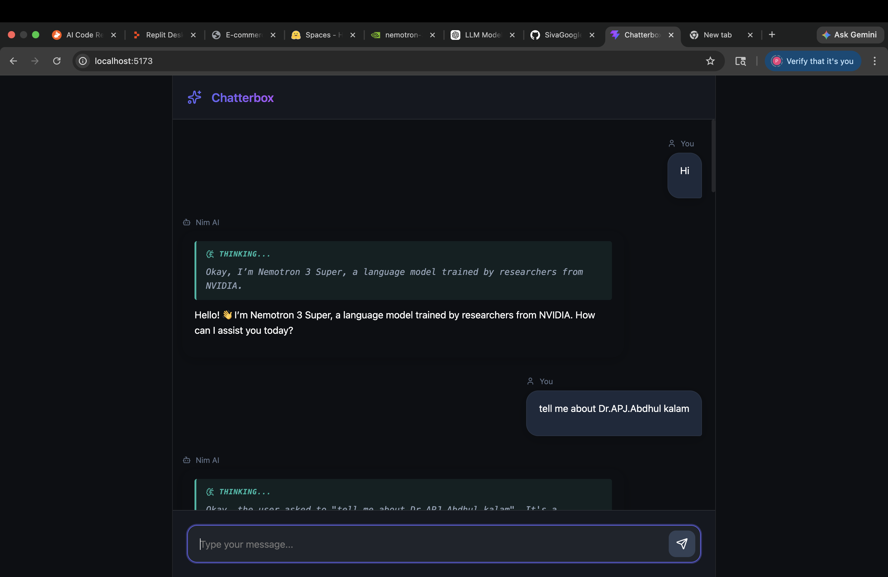

# Chatterbox 🚀



A premium, full-stack chat application built with **React** and **FastAPI**, integrating **NVIDIA Nim's** advanced reasoning models (`nvidia/nemotron-3-super-120b-a12b`).

## ✨ Features
- **Modern UI**: Dark-themed glassmorphism design with smooth animations.
- **Thinking Process**: Visual display of the AI's "reasoning" or "thinking" steps before the final answer.
- **Streaming Responses**: Real-time message delivery for a seamless chat experience.
- **Responsive Layout**: Optimized for all device sizes.

---

## 🛠️ Prerequisites
- **Python 3.8+**
- **Node.js 16+**
- **NVIDIA API Key**: Obtain one from [NVIDIA Build](https://build.nvidia.com/).

---

## 🏗️ Backend Setup (Python/FastAPI)

### Necessary Packages
- `fastapi`: The web framework.
- `uvicorn`: ASGI server to run the app.
- `openai`: Client for NVIDIA Nim API integration.
- `python-dotenv`: Management of environment variables.
- `pydantic`: Data validation.

### Setup Steps
1. Navigate to the backend directory:
   ```bash
   cd chat-app/backend
   ```
2. Create and activate a virtual environment:
   ```bash
   python3 -m venv venv
   source venv/bin/activate
   ```
3. Install dependencies:
   ```bash
   pip install -r requirements.txt
   ```
4. Configure your API key:
   - Open `.env` and replace `your_actual_api_key_here` with your NVIDIA API key.
5. Start the server:
   ```bash
   python main.py
   ```
   *The backend will be running at `http://localhost:8000`*

---

## 💻 Frontend Setup (React/Vite)

### Necessary Packages
- `lucide-react`: Modern icons.
- `framer-motion`: Smooth UI animations.
- `react-markdown`: For rendering AI responses with code blocks.

### Setup Steps
1. Navigate to the frontend directory:
   ```bash
   cd chat-app/frontend
   ```
2. Install dependencies:
   ```bash
   npm install
   ```
3. Start the development server:
   ```bash
   npm run dev
   ```
   *The frontend will be running at `http://localhost:5173`*

---

## 🚀 Quick Start (Unified Script)
If you want to start both servers with a single command, use the provided `start.sh` script from the project root:

```bash
chmod +x start.sh
./start.sh
```

---

## 📂 Project Architecture
- `/chat-app/backend/main.py`: Handles streaming logic and API communication.
- `/chat-app/frontend/src/App.jsx`: Main interface logic with streaming hooks.
- `/chat-app/frontend/src/index.css`: Custom design system and glassmorphism styles.
- `/prompt/bus-conductor/`: Contains the specialized persona prompt for the "Bus Conductor" assistance mode.

---

## 🧠 System Prompts
The application supports specialized AI personas defined in the `/prompt` directory:
- **Bus Conductor**: Located at `/prompt/bus-conductor/prompt.rtcfr.txt`. This prompt configures the AI to act as a professional and friendly bus conductor, assisting with fares, routes, and passenger safety.

---

## 🔒 Version Control & Security
A `.gitignore` file is included in the root directory to ensure that sensitive and unnecessary files are not tracked by Git:
- **Security**: `.env` files (containing your API keys) are ignored.
- **Dependencies**: `node_modules/` and `venv/` are excluded.
- **System**: macOS `.DS_Store` and IDE-specific files are ignored.
